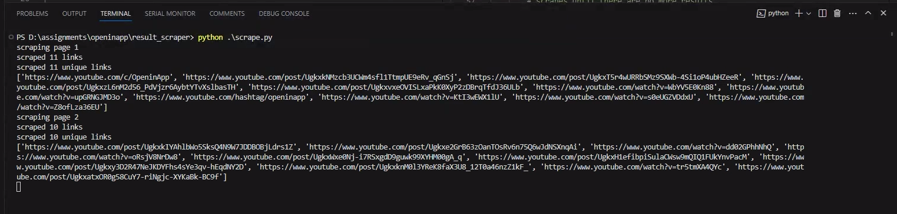
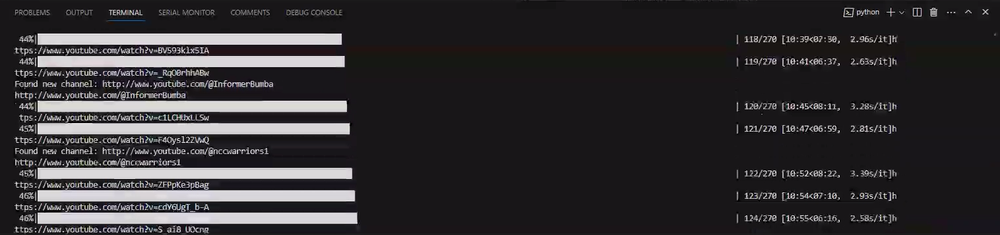
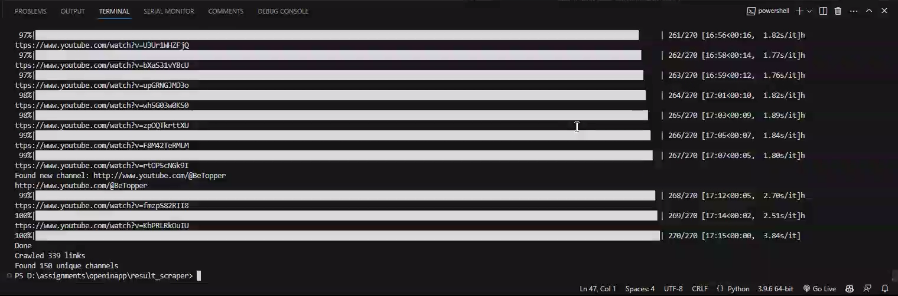

# Web Crawler Documentation

This documentation provides an overview of a Python web crawler that scrapes YouTube channel links from Google search results. The crawler is capable of retrieving the first 10,000 results for a specific Google search input and collects YouTube channel links from those results. The collected links are then saved in either JSON or CSV format.

## Table of Contents

- [Overview](#overview)
- [Installation](#installation)
- [Usage](#usage)
- [File Descriptions](#file-descriptions)
- [Code Walkthrough](#code-walkthrough)
- [Performance Considerations](#performance-considerations)
- [Conclusion](#conclusion)

## Overview

The web crawler is designed to perform the following tasks:

1. Perform a Google search using a specific query.
2. Scrape the all results from the search.
3. Extract YouTube channel links from the scraped results.
4. Save the collected links in JSON or CSV format.

The crawler is divided into two main parts:

1. `links_from_google.py`: This script handles the Google search and scraping of YouTube links from the search results.
2. `link_to_channel.py`: This script takes the collected YouTube links and retrieves the corresponding YouTube channel links.

The crawler employs various libraries such as  `httpx`, `BeautifulSoup`, `json`, `re`, and `tqdm` for web scraping and data processing.

## Installation

To run the web crawler, follow these steps:

1. Install Python 3.x on your system if you haven't already.
2. Clone the repository or download the source code files.
3. Open a terminal or command prompt and navigate to the project directory.
4. Install the required dependencies using the following command:

```shell
pip install -r requirements.txt
```

## Usage

To use the web crawler, follow these steps:

1. Open the `links_from_google.py` file and modify the `QUERY` variable to set your desired Google search query. By default, the query is set to "site:youtube.com openinapp.co".

2. Run the `links_from_google.py` script using the following command:

```shell
python links_from_google.py
```

The script will start scraping the Google search results and display progress information in the console. Once completed, it will save the collected YouTube links to a file named `yt_links.json`.

Open the `link_to_channel.py` file and verify that the `yt_links.json` file path is correct. If you have renamed the file or saved it in a different location, update the path accordingly.

Run the `link_to_channel.py` script using the following command:

```shell
python link_to_channel.py
```

The script will retrieve the corresponding YouTube channel links for the collected YouTube links. It will display progress information in the console and save the results to two files: `links_with_channel.json` and `unique_channels.json`.

The web crawler has completed its task. You can find the collected data in the output files specified above.


Alternatively a more direct method of running the crawler is to run the `scrape.py` script. This script will run both the `links_from_google.py` and `link_to_channel.py` scripts in sequence. The `scrape.py` script can be run using the following command:

```shell
python scrape.py
```


<!-- add video media/SERP_Scraper.mp4-->
<!-- add video media/data_walkthrough.webm-->
[](media/SERP_Scraper.mp4)
[](media/data_walkthrough.webm)


<!-- add 1.png,2.png, 3.png -->



## File Descriptions
The code creates the following files:
- `yt_links.json`: This file contains the collected YouTube links from the Google search results.
- `links_with_channel.json`: This file contains the collected YouTube links along with their corresponding YouTube channel links.
- `unique_channels.json`: This file contains the unique YouTube channel links from the collected YouTube links.

- Output of previous runs is available in bkp_results folder

- Media folder contains screenshots and videos of the crawler in action

## Code Walkthrough

The web crawler is divided into two main parts:
- `links_from_google.py`: This script handles the Google search and scraping of YouTube links from the search results.

- `link_to_channel.py`: This script takes the collected YouTube links and retrieves the corresponding YouTube channel links.

Please note the scraper is designed to scrape the first 10,000 results from a Google search however the search results for the query "site:youtube.com openinapp.co" only returned 35 Pages of results. Therefore the scraper will only scrape 35 pages of results for this query.

## Performance Considerations

The scraper is optimised for performance as it does not rely on selenium or any other browser automation tool. It uses the httpx library to make asynchronous requests to the Google search results page. The httpx library is a fast and modern HTTP client for Python. It is a drop-in replacement for requests and urllib3. It is also fully compatible with requests and urllib3 APIs.

There is an intentional delay of 3 second between each request to avoid being blocked by Google. This delay can be modified by changing time.sleep(3) to a different value. The requests can be made parallel however frequent requests to Google will result in being blocked by Google. Therefore the intentional delay is added to avoid being blocked by Google.


## Conclusion

The web crawler is capable of scraping all the YouTube links from the Google search results for a specific query. The collected links can be used for further analysis or research purposes. The crawler can be modified to scrape other types of links from Google search results.